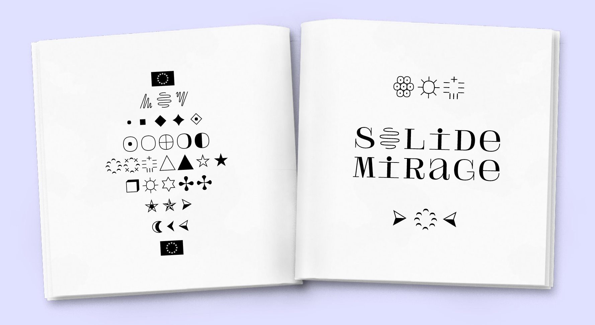
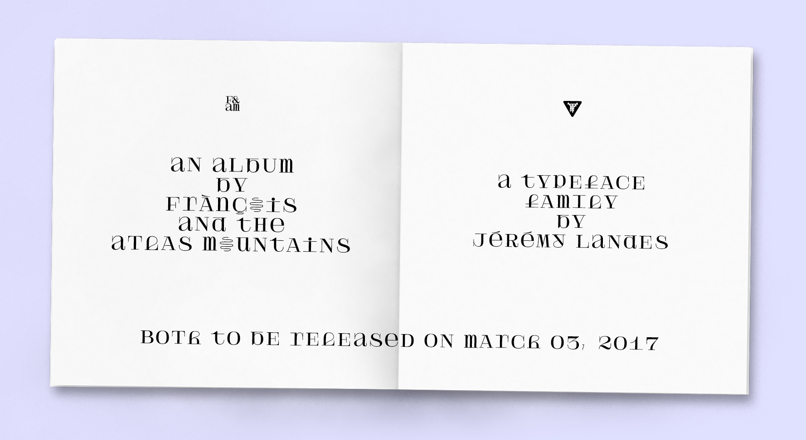
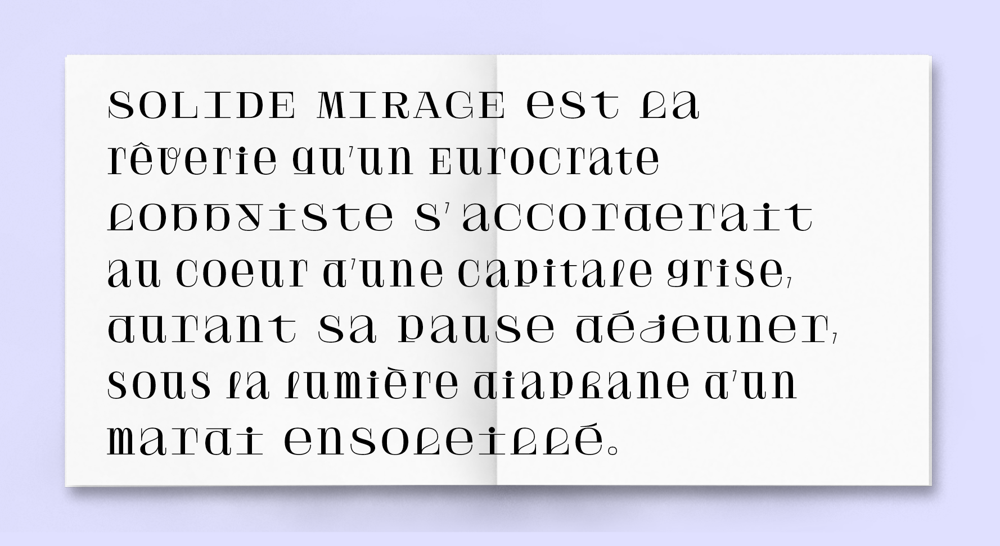
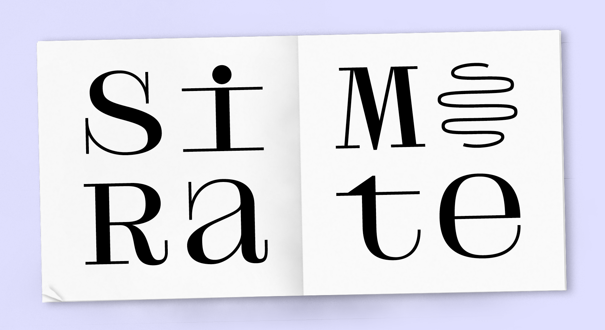
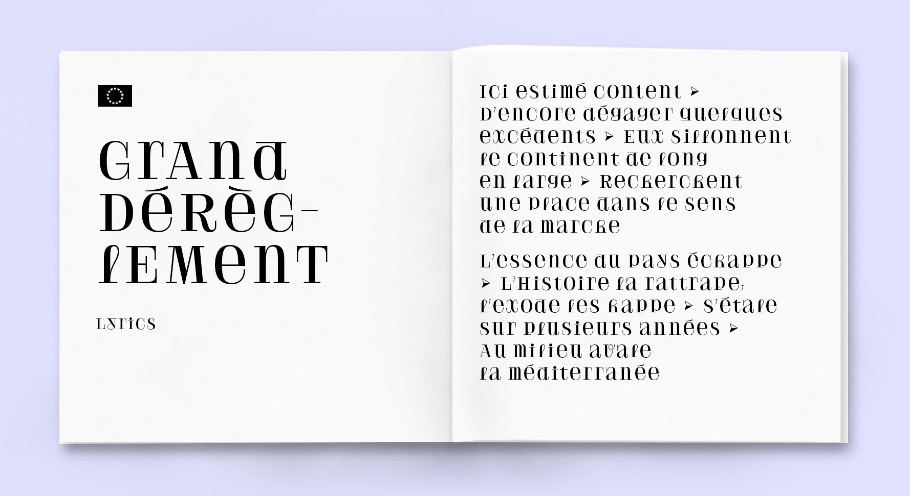
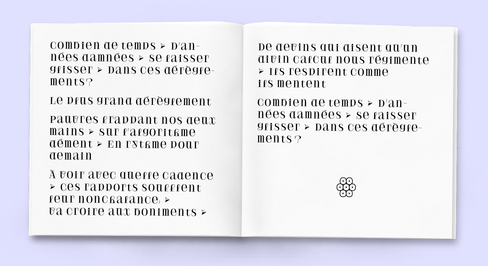
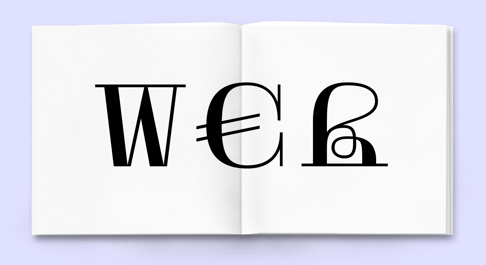
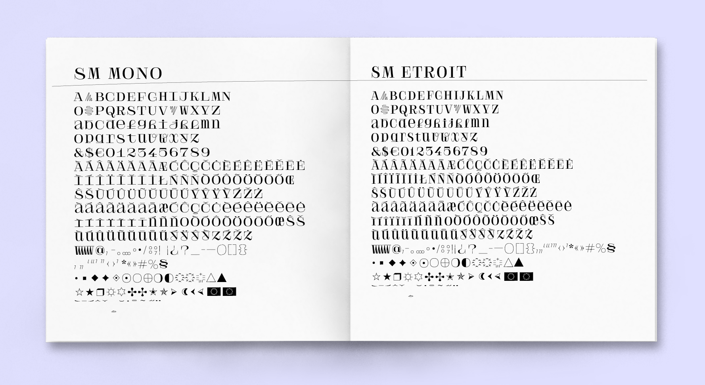
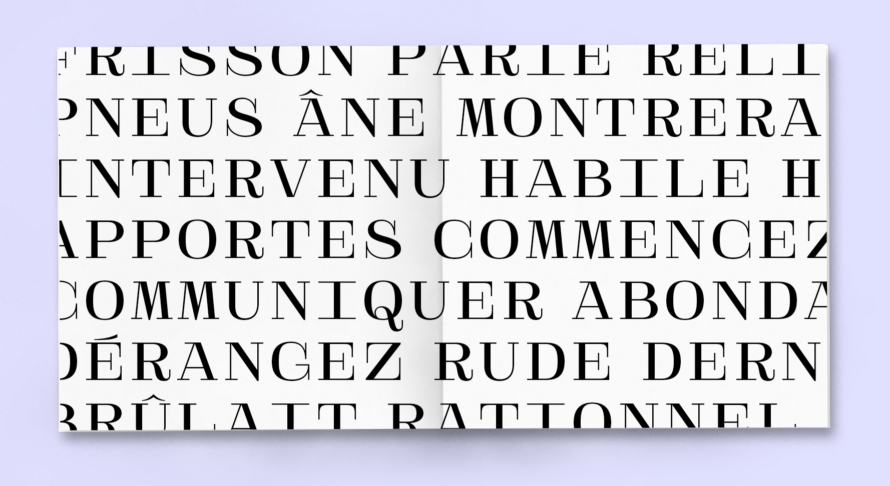

# Solide Mirage

Solide Mirage is a custom typeface designed for the band [Frànçois And The Altas Mountains](francoisandtheatlasmountains.com) and released by [Velvetyne Type Foundry](http://velvetyne.fr/fonts/solide-mirage/).

Solide Mirage is a display face inspired by both the Didone genre and the music of Frànçois And The Atlas Mountains. Solide Mirage is an unicase, encouraging the user to stir lowercases and uppercases together. If the caps remains quite classical, the lowercases show a stronger temperament. All the lowercases that should have ascenders or descenders, as the b, d, p or q are the most suprising, with there compressed shapes and long serifs. Solide Mirage began as a squared monospaced typeface, for practical layout reasons, quickly followed by a proportional companion, a more narrow design to allow subtler text layouts. Both typefaces have ornemental alternates A, O and V inheriting the zig-zag spirit of the album cover created by the visual artist Tatiana Defraine. A small set of ornaments completes the letter shapes for flourishing layouts.

Contribute or download it on [Velvetyne Type Foundry](http://velvetyne.fr/fonts/solide-mirage/).

## Specimen

## Team

Solide Mirage is a font by [Jérémy Landes](http://studiotriple.fr). [Walid Bouchouchi](https://www.akakir.com/f) assisted him on the project. [George Triantafyllakos](https://backpacker.gr/) drew the Greek for the "Mono" style based on the Latin. Jérémy adapted these shapes to the "Etroit" style.

## License

Solide Mirage is licensed under the SIL Open Font License, Version 1.1.
This license is copied below, and is also available with a FAQ at
http://scripts.sil.org/OFL

## Repository Layout

This font repository follows the Unified Font Repository v2.0,
a standard way to organize font project source files. Learn more at
https://github.com/unified-font-repository/Unified-Font-Repository
